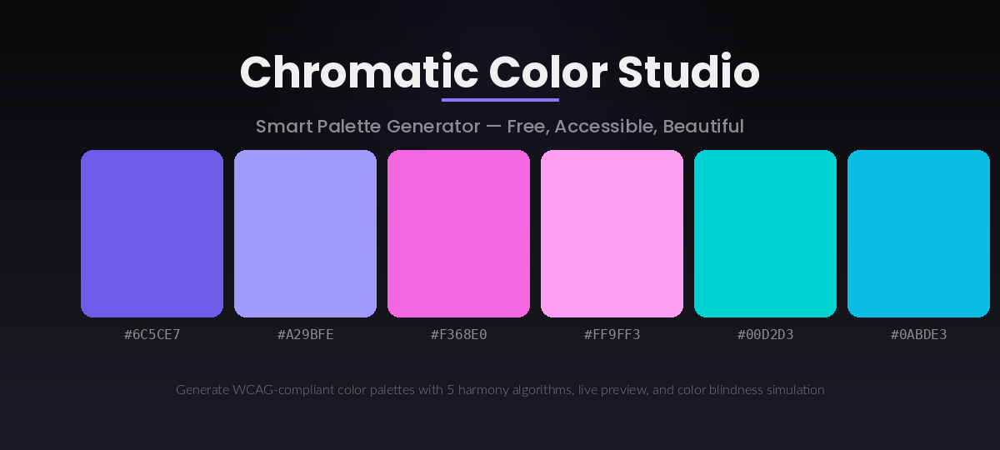
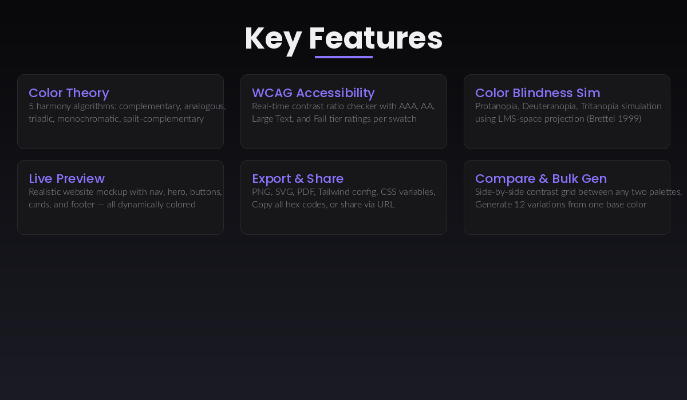

# Smart Palette Generator -- Chromatic Color Studio

[](https://opensource.org/licenses/MIT)
[](https://hhhpraise.github.io/smart-color-palette-generator/)
[](https://github.com/Hhhpraise/smart-color-palette-generator/stargazers)



A free, browser-based color palette generator built on established color theory. Create WCAG 2.1 compliant color schemes with live previews, color blindness simulation, and professional export formats. Designed for front-end developers, UI/UX designers, and anyone who works with color.

## Live Demo

**[Try it now](https://hhhpraise.github.io/smart-color-palette-generator/)**

---

## Features



### Core Palette Engine

- **Five harmony algorithms** -- Monochromatic, Complementary, Analogous, Triadic, and Split-Complementary. Each generates a 6-color palette from any base hex color using HSL-space transformations.
- **Real-time validation** -- Enter any hex code or use the color picker. Both inputs stay synchronized. Invalid input is flagged instantly.
- **Interactive swatches** -- Click to copy any hex, RGB, or HSL value. Double-click for the tints-and-shades explorer (10-step spectrum). Drag to reorder swatches. Lock individual colors to preserve them during regeneration.

### Accessibility

- **WCAG 2.1 contrast checker** -- Every swatch displays its contrast ratio against white, labeled with the appropriate WCAG tier: AAA (7:1 or greater), AA (4.5:1+), Large Text (3:1+), or Fail (below 3:1). Hover for the full explanation.
- **Readability optimization** -- The auto-arrange algorithm shuffles your palette into the order that maximizes text-on-background contrast across the preview.
- **Color blindness simulation** -- Toggle between Normal, Protanopia (red-deficient), Deuteranopia (green-deficient), and Tritanopia (blue-deficient) views. The simulation uses scientifically validated LMS-space projection matrices (Vienot-Brettel-Mollon 1999) rather than simple hue shifts, so the results accurately represent what a dichromatic viewer would perceive.

### Live Preview

A fully styled website mockup in the Palette tab applies your colors in real time: navigation bar, hero section with gradient background, call-to-action buttons, feature cards, and footer all update dynamically. Toggle any color blindness mode and watch the entire preview transform.

### Gallery and Bulk Generation

- **24 curated palettes** -- Professionally designed color combinations organized by theme (Sunset Boulevard, Nordic Frost, Cyberpunk Neon, Espresso Shot, etc.). Each is tagged for easy browsing. One click loads it into the main palette view.
- **Bulk generate** -- Produce 12 palette variations from a single base color: one for each harmony algorithm plus 7 randomly shuffled variants. All rendered in a compact grid -- click any to apply.

### Compare Mode

Open the Compare modal to see a full contrast-ratio matrix between your current palette and any saved favorite or curated gallery palette. Each cell shows the exact WCAG contrast ratio, color-coded green/amber/red. A summary footer reports the percentage of pairings that pass WCAG AA.

### Export Formats

| Format | Details |
|--------|---------|
| **PNG** | 1200x600 raster with gradient background, swatch labels, and palette name |
| **SVG** | Resolution-independent vector with round-rect swatches and gradient defs |
| **PDF** | Landscape PDF with per-color rounded rectangles and WCAG rating overlay |
| **Tailwind** | Ready-to-paste `tailwind.config.js` color extension with named keys |
| **CSS Variables** | `:root { ... }` block with algorithm-prefixed custom properties |
| **Copy All** | Bulk copy of all hex codes, one per line |
| **Share URL** | Bookmarkable link with current color and algorithm encoded as query params |

### Tools Tab

- **Image color extraction** -- Drag and drop any image to extract its 6 dominant colors using 64-bucket color quantization. Click to use the extracted palette.
- **Gradient builder** -- Visual gradient editor with angle control, radial/linear toggle, draggable color stops, and one-click CSS copy.

### Keyboard Shortcuts

| Key | Action |
|-----|--------|
| `Space` | Random base color |
| `1` through `5` | Select harmony algorithm |
| `Enter` | Generate palette (when hex input is focused) |

---

## Technology Stack

| Technology | Role |
|------------|------|
| **HTML5** | Semantic structure, JSON-LD structured data, ARIA attributes |
| **CSS3** | Custom properties, dark/light themes, responsive grid, backdrop-filter glass effects |
| **JavaScript (ES6)** | Color math (HSL/HEX/RGB/LMS), drag-and-drop, localStorage persistence, Canvas export |
| **jsPDF** | PDF generation with gradient backgrounds and rounded rectangles |
| **Font Awesome 6** | Iconography |
| **Google Fonts** | Syne (display headings), DM Sans (body), DM Mono (code) |

---

## Project Structure

```
smart-color-palette-generator/
├── index.html              # Main entry point — all UI structure, SEO meta, JSON-LD
├── style.css               # Design tokens, layout, dark theme, animations
├── style-additions.css     # Light theme, tabs, modals, gallery, CVD bar, compare, tools
├── js/
│   ├── color-theory.js     # HSL/HEX/RGB conversion, 5 harmony algorithms, contrast math
│   ├── storage.js          # localStorage manager (settings, history, favorites)
│   ├── app-core.js         # Main controller — palette gen, preview rendering, events, export
│   ├── app-gallery.js      # 24 curated palettes, bulk generate, compare mode
│   └── app-tools.js        # CVD simulation (LMS projection), image extraction, gradient builder
├── og-image.png            # Open Graph / social sharing preview image (1200x630)
├── readme-hero.png         # README hero banner
├── readme-features.png     # README feature grid
├── LICENSE
└── README.md
```

---

## Quick Start

### Prerequisites

A modern web browser -- Chrome 70+, Firefox 65+, Safari 12+, or Edge 79+.

### Local Development

```bash
git clone https://github.com/Hhhpraise/smart-color-palette-generator.git
cd smart-color-palette-generator

# Serve with Python
python -m http.server 8000
# Open http://localhost:8000

# Or with Node
npx serve .
```

### Deploy to GitHub Pages

Push to the `main` branch of your repository and enable GitHub Pages in the repository Settings. The site will be live at `https://yourusername.github.io/smart-color-palette-generator/`.

---

## Color Theory Reference

### Monochromatic
Variations of a single hue by adjusting lightness and saturation. Produces cohesive, restrained designs. Best suited for corporate interfaces, minimalist layouts, and luxury branding where a single-color identity is essential.

### Complementary
Colors 180 degrees apart on the color wheel. Maximum visual contrast. Well-suited for call-to-action buttons, hero sections, and any element that must draw immediate attention.

### Analogous
Colors within 30 to 60 degrees of each other on the wheel. Natural, low-tension harmony. Ideal for gradients, nature-inspired themes, and background layers where subtle transitions are desired.

### Triadic
Three colors evenly spaced at 120-degree intervals. Balanced and vibrant without the intensity of pure complements. Useful for data visualization, playful interfaces, and creative portfolios.

### Split-Complementary
The base color plus the two colors adjacent to its complement. Offers the contrast of a complementary scheme with more nuance and a broader palette. Works well for complex interfaces, editorial layouts, and premium product pages.

---

## Color Blindness Simulation -- Technical Detail

The simulator converts sRGB to linear RGB, projects through the Hunt-Pointer-Estevez LMS (Long, Medium, Short wavelength cone response) transform, applies a deficiency-specific dichromatic projection matrix, and converts back to sRGB. This produces results that match psychophysical measurements rather than simple hue-rotation approximations.

| Type | Affected Cones | Prevalence | Visual Effect |
|------|---------------|------------|---------------|
| **Protanopia** | L-cones (red) absent or non-functional | ~1% of males | Reds appear darkened; confusion between red/green and blue/purple |
| **Deuteranopia** | M-cones (green) absent or non-functional | ~1% of males | Similar to protanopia but without the dimming of reds |
| **Tritanopia** | S-cones (blue) absent or non-functional | ~0.003% | Blues appear greenish; yellows appear pinkish; very rare |

Reference: Vienot, F., Brettel, H., & Mollon, J. D. (1999). Digital video colourmaps for checking the legibility of displays by dichromats. *Color Research & Application*, 24(4), 243-252.

---

## Browser Support

| Browser | Minimum Version | Status |
|---------|----------------|--------|
| Chrome | 70+ | Fully supported |
| Firefox | 65+ | Fully supported |
| Safari | 12+ | Fully supported |
| Edge | 79+ | Fully supported |
| Mobile Safari | 12+ | Fully supported |
| Chrome for Android | 70+ | Fully supported |

---

## Troubleshooting

**The live preview, CVD simulation, gallery, or compare features do not appear to work.**

Your browser may have cached older JavaScript files. Perform a hard refresh: `Ctrl+Shift+R` on Windows/Linux or `Cmd+Shift+R` on macOS. Alternatively, open DevTools (F12), right-click the refresh button, and select "Empty Cache and Hard Reload."

**The color blindness buttons do not change the preview.**

A palette must be generated first (click "Generate Palette"). The simulation applies to the website mockup in the Palette tab. Watch the navigation bar, hero section, buttons, and feature cards change as you toggle modes.

**The Compare button shows no options.**

The Compare feature draws from both your saved favorites and the 24 built-in curated gallery palettes. Even with no saved favorites, the curated options appear in a dropdown group. Click Compare, select a palette, and the contrast grid renders immediately.

---

## Contributing

### Reporting Issues

Use the [GitHub issue tracker](https://github.com/Hhhpraise/smart-color-palette-generator/issues). Include your browser version, steps to reproduce the problem, and screenshots or console output if relevant.

### Pull Requests

1. Fork the repository
2. Create a feature branch: `git checkout -b feature-name`
3. Make changes with clear, descriptive commit messages
4. Test across multiple browsers
5. Submit a pull request with a summary of changes and motivation

### Code Standards

- JavaScript: ES6+ strict mode, no undeclared globals, self-documenting function names
- CSS: Custom properties over hardcoded values, mobile-first responsive breakpoints
- Accessibility: Maintain WCAG 2.1 AA compliance, test keyboard navigation and screen reader compatibility
- Performance: Keep the total JS payload under 100 KB (unminified)

---

## License

This project is licensed under the MIT License. See [LICENSE](LICENSE) for the full text.

You may use, modify, distribute, and sublicense this software freely in both personal and commercial projects, with no obligation to publish your changes.

---

## Author

**Hhhpraise**

- [Portfolio](https://hhhpraise.github.io/portfolio/)
- [GitHub](https://github.com/hhhpraise)
- [Email](mailto:hhhpraise33@gmail.com)

---

*Built for the design and development community. If you find this tool useful, consider starring the repository.*
